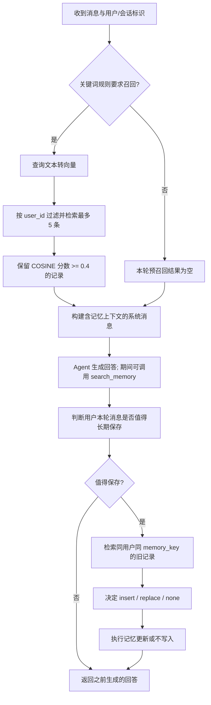
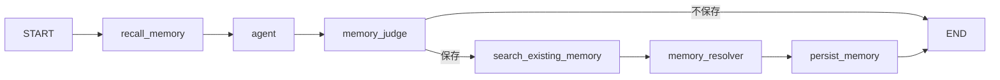

# 自动召回：从当前代码理解 Agent 的长期记忆

本文基于 2026-09-30 的项目代码，围绕 `main.py → tools.py → Milvus → Agent` 解释自动召回。阅读目标是：能画出调用流程、解释每个参数、判断问题出在哪一层，并能设计验证召回效果的实验。

**文档中的“当前实现”描述已有代码；“建议改造”尚未实现。** 已确认的缺陷和验收任务见 [项目 TODO](TODO.md)。已有的 [Agent 学习路线](agent_learning_roadmap.md) 中部分代码描述早于当前实现，涉及本项目记忆逻辑时以源码和本文为准。

阅读导航：

- [概念与源码地图](#concepts)：第 1～3 节。
- [当前自动召回流程](#current-flow)：第 4～9 节。
- [Graph 改造思路](#graph-design)：第 10 节。
- [可运行的离线实验](#offline-lab)：第 11 节。
- [策略、评估和排错](#evaluation)：第 12～15 节。
- [学习顺序与参考资料](#learning)：第 16～18 节。

<a id="concepts"></a>

## 1. 自动召回解决什么问题

假设用户在会话 A 中明确说过：

> 我目前做前端，接下来希望转向全栈开发。

系统将这个事实保存为长期记忆。几天后，用户在新会话 B 中问：

> 根据我的职业方向，接下来应该学习什么？

自动召回会在生成回答前，从该用户的长期记忆中寻找相关事实，把“从前端转向全栈”加入本轮上下文。模型因此能结合已有背景作答，而不必要求用户每次重新介绍自己。

这里至少有三个前提：旧信息成功保存了、本次检索找到了它、回答模型正确使用了它。只实现其中一步，不能保证最终回答有记忆。

模型参数不会因为这条记录而发生训练更新。长期记忆保存在外部数据库，召回时只是把相关文本重新提供给模型。它属于检索增强生成的一种应用。

## 2. 先区分五个概念

| 概念 | 回答的问题 | 当前项目的位置 | 生命周期或范围 |
| --- | --- | --- | --- |
| 短期会话历史 | “这一轮之前聊了什么？” | `InMemorySaver`、消息列表 | 当前进程内的某个 thread；重启后不保留 |
| 用户长期记忆 | “这个用户有什么长期偏好、目标和背景？” | Milvus 的 `agent_memory` | 按用户存储；能否保留取决于数据库存储和部署配置 |
| 内部知识库 | “文档中有什么知识？” | Milvus 的 `demo_collection` | 文档内容；不等于个人聊天历史 |
| 自动召回 | “回答之前，要由程序先读取哪些记忆？” | `main.chat()` 调用 `_recall_memories()` | 程序控制时机，不依赖模型先发出工具调用 |
| 工具召回 | “模型推理过程中还需要找什么记忆？” | `search_memory` 工具 | 模型决定是否调用、用什么查询词 |

还要区分三个 ID：

| 字段 | 含义 | 正确的边界 |
| --- | --- | --- |
| `user_id` | 用户身份 | 应由可信的服务端身份上下文确定 |
| `session_id` | 用户的一次对话 | 属于特定用户，不能只凭客户端传来的字符串认定归属 |
| `thread_id` | Checkpointer 保存和恢复状态的键 | 必须隔离用户与会话；同一用户不同会话也应有不同键 |

跨会话召回依靠同一个用户的长期记忆，不需要让不同会话共用 `thread_id`。目前代码直接把 `session_id` 当作 `thread_id`，不同用户传入相同值会串历史，这是已确认的缺陷。

## 3. 从哪些文件开始读

| 文件与函数 | 阅读重点 |
| --- | --- |
| [main.py](../src/agent/main.py)：`chat` | 回答前召回、上下文拼接、调用 Agent、回答后判断是否保存 |
| [main.py](../src/agent/main.py)：`should_recall_memory` | 当前基于关键词的召回开关 |
| [tools.py](../src/agent/tools.py)：`_recall_memories` | 向量化、用户过滤、Top-K 检索、分数过滤 |
| [tools.py](../src/agent/tools.py)：`search_memory` | 由模型选择调用的记忆工具 |
| [tools.py](../src/agent/tools.py)：`_get_memories_by_keys` | 按用户与类别读取全部旧记忆，供去重和更新判断 |
| [tools.py](../src/agent/tools.py)：`_insert_memory`、`replace_memory` | 用独立 ID 新增，以及按已选旧 ID 更新 |
| [graph.py](../src/agent/graph.py)、[schemas.py](../src/agent/schemas.py)、[smith.py](../src/agent/smith.py) | 另一套 Graph 编排及其状态和工具配置 |

项目存在两条独立实现：

- **`main.py` 路线**：有回答前自动召回，也有模型工具召回；回答生成后处理长期记忆写入。API 目前意图调用这条路线，但其导入路径有待修复。
- **`graph.py` 路线**：先进入 `agent` 节点，再判断是否保存、检索旧记录、解决冲突、写入。它还没有回答前的自动召回节点。`search_existing_memory` 是写入前检索，不能理解为回答前召回。

不要因为两条路线都调用了搜索函数，就认为它们已经具有相同的记忆行为。

<a id="current-flow"></a>

## 4. 当前主流程：读记忆和写记忆发生在不同阶段



这张图反映的是当前 `main.chat()` 的同步调用顺序。

1. 先召回旧记忆，再生成回答。本轮新事实尚未写库，但已经存在于当前用户消息里，模型可以直接看到。
2. `agent.invoke()` 完成之后，仍然会调用 `judge_memory()`；有旧记忆时一次调用 `resolve_memories()` 批量判断，并在校验结果后写入。
3. 直到这些步骤结束，函数才执行 `return`。因此“回答已经生成”不等于“用户已经收到回答”。当前记忆写入阶段的异常仍可能让整个聊天请求失败。
4. 关键词门控为 `False` 只代表跳过**预召回**；Agent 仍可能调用 `search_memory`。

## 5. 第一步：判断是否需要预召回

当前 `should_recall_memory()` 的核心规则是：

```python
has_personal_signal = any(word in message for word in personal_keywords)
has_memory_topic = any(word in message for word in memory_topics)
return has_personal_signal and has_memory_topic
```

`personal_keywords` 包含“我”“我的”“记得”“之前说过”等；`memory_topics` 包含“方向”“目标”“计划”“偏好”“喜欢”“工作”“职业”“学习”“项目”“技术栈”“习惯”“情况”。两组各命中至少一个字符串才触发。

这是子字符串匹配，没有分词、语义理解或否定识别。因为“我”本身就在第一组里，很多包含“我的”的句子无需其他信号就能满足第一组条件。

| 消息 | 当前结果 | 为什么 |
| --- | --- | --- |
| 根据我的职业方向，推荐学习计划 | `True` | 有“我”，也有“职业”“方向”等 |
| 我的项目采用什么技术栈？ | `True` | 有“我”和“项目”“技术栈” |
| 我想学习二叉树 | `True` | 命中“我”和“学习”；但未必需要个人记忆 |
| 你还记得我的名字吗？ | `False` | 有个人信号，但“名字”不在主题列表中 |
| 用中文回答 | `False` | 未命中个人信号或主题 |
| Python 的列表怎么排序？ | `False` | 是普通知识问题 |

这里有两类错误：

- **漏触发**：本来需要用户记忆，却没进入预召回，例如询问名字。
- **误触发**：普通知识问题也进入了预召回，例如“我想学习二叉树”。

建议先记录这两类样本，再扩充规则或引入意图分类。`main.py` 中虽然定义了 `MemoryRecallDecision`，目前没有将它接入预召回判断；不能把这个类的存在当成已实现 LLM 路由。

## 6. 第二步：把文本变成可以比较的向量

项目在 `tools.py` 中初始化：

```python
model_path = os.path.expanduser("~/models/bge-base-zh-v1.5")
embed_model = HuggingFaceEmbeddings(model_name=model_path)
```

写入时，记忆文本经过 `embed_query(memory)` 得到向量；召回时，当前问题经过 `embed_query(query)` 得到查询向量。数据库寻找与查询向量接近的记忆向量，再返回原始文本。

向量是一串数值，并不是把文字压缩后再解压还原。检索结果中的文字来自记录的 `memory` 字段。

当前记忆 Collection 的主要字段如下：

| 字段 | 当前定义 | 用途 |
| --- | --- | --- |
| `id` | VARCHAR，最长 64 字节，主键 | 唯一标识一条记录 |
| `user_id` | VARCHAR，最长 64 字节 | 限定记录所属用户 |
| `memory_key` | VARCHAR，最长 64 字节 | 信息类别，例如 `career_direction` |
| `memory` | VARCHAR，最长 2000 字节 | 供模型阅读的事实文本 |
| `vector` | FLOAT_VECTOR，768 维 | 用于语义检索 |

这些是源码建表时的定义。`tools.py` 只在 Collection 不存在时创建它，**不会验证已存在 Collection 的维度、字段或索引是否一致**。

更换 Embedding 模型时，不应只修改模型路径。应检查模型输出维度、查询和文档编码方式、归一化及模型版本；即使两个模型同为 768 维，它们的向量空间也不一定兼容。通常需要重新生成旧记录向量，并重新评估阈值。

当前实现把记忆和查询都交给 `embed_query`。是否要使用不同编码方法或查询指令，应以选用模型的说明和本项目评测为依据，不要在保留旧向量时随意更改查询侧编码配置。

## 7. 第三步：用户过滤、Top-K 和分数阈值

当前 `chat()` 明确传入：

```python
recalled_memories = _recall_memories(
    user_id=user_id,
    query=message,
    limit=5,
    min_score=0.4,
)
```

而 `_recall_memories()` 的函数默认参数是 `min_score=0.45`。因此：

- 经 `chat()` 进入时，有效阈值为 **0.4**。
- 单独调用该函数且省略 `min_score` 时，才使用 **0.45**。

### 7.1 用户过滤决定检索范围

核心调用如下。这是**当前代码摘录**，不是推荐直接复制到多用户服务的安全模板：

```python
results = client.search(
    collection_name=MEMORY_COLLECTION,
    data=[query_vector],
    anns_field="vector",
    limit=limit,
    filter=f'user_id == "{user_id}"',
    output_fields=["id", "user_id", "memory_key", "memory"],
)
```

过滤表达式由 Milvus 在检索时使用，而不是先取全库 Top-5 再由 Python 丢掉其他用户。后者既可能泄露信息，也可能让本来存在的相关结果被其他用户占掉名额。

不过，**有过滤表达式不等于完成了身份认证**。当前 API 的 `user_id` 是请求字段，工具参数中的 `user_id` 也暴露给模型。建议从可信运行时绑定身份，并使用受支持的过滤参数模板，或严格限制和转义标识符，避免直接拼接未经验证的输入。具体 API 需匹配安装的 SDK 版本。[Milvus 过滤说明](https://milvus.io/docs/filtered-search.md)

### 7.2 Top-K 只限制候选数量

`limit=5` 表示一次查询最多返回 5 条候选，并不保证有 5 条结果，更不保证 5 条都相关。

当前代码只传入一个查询向量：`data=[query_vector]`，因此主要处理 `results[0]`。外层列表对应每个查询向量，内层列表才是这个查询的候选记录。

### 7.3 当前记忆库使用 COSINE，分数越大越相似

`agent_memory` 在源码中创建的是 `COSINE` 索引。余弦相似度可写为：

```text
cosine(q, m) = dot(q, m) / (norm(q) × norm(m))
```

对非零向量，其理论范围为 `[-1, 1]`，越大表示方向越接近。Milvus 搜索结果的字段虽然叫 `distance`，在当前 COSINE 度量下应当把它理解为“相似度分数”。它不是概率；`0.8` 不表示“有 80% 的概率正确”。[Milvus 度量说明](https://milvus.io/docs/metric.md)

当前过滤逻辑是：

```python
score = float(hit["distance"])
if score < min_score:
    continue
```

因此等于阈值的记录会保留。以下分数仅用于教学，不是模型实测：

| 候选记忆 | 示例分数 | 阈值为 0.4 时 |
| --- | --- | --- |
| 用户计划从前端转向全栈 | 0.82 | 保留 |
| 用户每周安排时间学习后端 | 0.57 | 保留 |
| 用户喜欢某种饮食 | 0.39 | 过滤 |

知识库 `demo_collection` 的建表脚本使用的是 `L2`，其距离越小越接近。不能把这个 `score >= threshold` 规则直接搬过去。应先确认实际 Collection 的度量，再解释分数方向。

### 7.4 相似不代表事实有效

“主要想做前端”和“现在改为全栈”可能都很接近职业规划问题。如果两条冲突记忆同时存在，仅靠向量相似度无法决定哪条更新、更可信。

相关性过滤、事实有效性、时间有效性是三件不同的事。当前 Schema 没有 `updated_at`、有效状态或来源字段，不能声称系统已经完成了过期和冲突过滤。

## 8. 第四步：把记录组织成模型上下文

当前代码把结果拼成：

```text
- [career_direction] 用户计划从前端转向全栈开发。
- [learning_direction] 用户希望补充后端基础。
```

随后放入本轮系统消息，与当前用户 ID、时间、使用规则一起传给 Agent。规则强调：只用相关记忆、不强行套用、当前用户明确表达的信息优先、不根据旧记忆自行推测。

没有结果时，无论是门控未触发、库中没有候选，还是所有候选低于阈值，当前提示词都使用“暂无相关长期记忆。”。这段话仅描述本次上下文，不应被回答模型扩大理解为“数据库里没有关于该用户的任何信息”。

建议改造时注意以下几点：

1. 把身份、固定行为规则与检索到的事实分开组织。记忆文本是数据，其中即使包含“忽略前面的要求”等句子，也不应变成新的系统指令。
2. 限制注入条数和文本长度，去掉重复、冲突或失效事实。把整个记忆库塞进上下文通常会增加噪声。
3. 明确当前消息优先。例如用户说“我已经不做前端了”，不能因旧记忆又推荐前端路线。
4. 避免每轮把动态记忆系统消息永久追加到历史。当前 `main.py` 每轮都会构造新系统消息，在 Checkpointer 下会累计，旧召回内容可能继续留在后续上下文中。可将本轮召回保存在独立状态字段，在调用模型时临时组装。

检索是为回答提供证据，不是保证模型一定正确使用证据。评估时需要同时查看“召回了什么”和“最终回答使用了什么”。

## 9. 三条搜索路径不能混为一谈

| 路径 | 调用时机 | 查询内容 | 用户/类别范围 | 过滤与返回 |
| --- | --- | --- | --- | --- |
| `_recall_memories` | 回答前，由程序触发 | 用户当前消息 | 当前用户，不限定 `memory_key` | Top-5，再按阈值筛选；返回记录列表 |
| `search_memory` | Agent 决定调用工具时 | 模型生成的查询 | 工具参数指定的用户，不限定类别 | Top-5；当前没有分数阈值；返回文本 |
| `_get_memories_by_keys` | 准备保存候选事实时 | 候选记忆所属类别 | 同用户、指定 `memory_key` | 精确读取该类别全部记录及其 ID，供冲突判断 |

所以可能出现这样的现象：预召回把低分记录排除了，Agent 又调用 `search_memory`，将这些记录作为工具结果读了回来。这不是预召回阈值没有执行，而是两条读取路径采用了不同规则。

建议让自动召回和工具召回复用同一个底层检索服务，统一用户绑定、相关性标准、有效性过滤和日志。保留两条入口是可以的，但它们不应有相互矛盾的信任边界。

写入前的搜索则服务于另一个目标：判断候选事实应该新增、替换还是忽略。例如：

| 已有事实 | 新事实 | 期望处理 |
| --- | --- | --- |
| 想向全栈发展 | 计划转向全栈 | 去重，通常不重复写入 |
| 主要做前端 | 已决定转做后端 | 找到对应旧事实并更新 |
| 喜欢清淡饮食 | 不喜欢香菜 | 两条独立偏好都保留 |

当前新增记录使用 UUID 和 `insert`，同类独立事实可以共存。更新时，模型必须从该类别旧记录中选出目标 `memory_id`；程序先校验目标属于本轮查到的记录，`replace_memory()` 再确认目标仍属于当前用户和类别，然后复用原 ID 更新文本与向量。旧版固定主键记录也能通过字段查询读到，无需先迁移。真实 Milvus 联调仍是 [TODO](TODO.md) 中的待验收项。

当前 `main.chat()` 的回答后写入顺序是：

1. `judge_memory()` 只从本轮用户消息提取候选事实；程序拒绝空内容和重复的 `memory_key`。
2. `_get_memories_by_keys()` 按用户和候选类别读取全部旧记录。没有旧记录的类别准备直接新增；有旧记录的类别把候选内容与全部 `{id, memory}` 交给 `resolve_memories()` 一次批量判断。
3. 每个已有类别必须恰好有一条决策。`none` 跳过；`insert` 表示同类独立事实；`replace` 必须给出本类别旧记录的 ID 和非空的新内容。程序先校验整批决策，再开始任何写入，因此缺项、重复类别或越权目标不会造成“前几个已经写入”的结果。
4. `_insert_memory()` 用新 UUID 执行插入；`replace_memory()` 先按目标 ID 再查一次所属用户和类别，然后复用该 ID 更新文本及向量。模型返回顺序不决定更新顺序，程序按 `memory_key` 对应。

这保证了模型决策格式错误时不发生部分写入；**多个数据库写入本身仍不是事务**，后续写入失败时可能留下前面已完成的更新。同一条消息中同一类别的多个独立事实也尚未拆成多个候选，相关限制记录在 [TODO](TODO.md)。

如果业务明确规定某个槽位只能保存一个值，固定槽位主键可以成立。但此时必须同步修改候选分类和冲突处理契约，不能一边宣称支持同类多条事实，一边把整类只存成一条。

<a id="graph-design"></a>

## 10. 在 Graph 中加入自动召回：建议结构

当前 Graph 的顺序是：

```text
START → agent → memory_judge
                     ├─ 不保存 → END
                     └─ 保存 → search_existing_memory → memory_resolver → persist_memory → END
```

建议在 Agent 前增加专门的召回步骤：



状态可按以下思路设计。**下面只是改造片段，当前仓库尚未采用，也不是完整可运行替换文件。**

```python
from typing import Annotated, TypedDict
from langchain_core.messages import BaseMessage
from langgraph.graph.message import add_messages

class RecallState(TypedDict):
    messages: Annotated[list[BaseMessage], add_messages]
    user_id: str
    recalled_memories: list[dict]
    recall_status: str
```

关键设计：

- `messages` 用消息合并规则维护历史。当前普通 `list` 会在新一轮传入消息时覆盖历史。
- `recalled_memories` 保存本轮结果，采用覆盖语义；每轮都写入新列表，跳过或无结果时明确写入 `[]`，防止沿用上一轮记忆。
- `recall_status` 区分 `skipped`、`hit`、`empty`、`unavailable` 等状态；这是建议新增的可观测性字段。
- 召回 Query 应来自本轮用户输入，或由历史明确改写出的查询，不要错误地取上一条 AI 回复。
- `agent` 节点临时组合固定提示词、当前召回和会话历史，不把动态记忆反复写回长期消息列表。
- 若节点返回整段历史，必须保留消息 ID，并理解 `add_messages` 的按 ID 合并行为；更清晰的做法是只返回新产生的消息。不要把旧消息重建为无 ID 的对象再重复追加。
- 用户身份从可信请求上下文贯穿召回、工具调用和写入；当前 Graph 只把 `messages` 传给内层 Agent，没有将 `user_id` 绑定到记忆工具。

消息合并规则可对照 [LangGraph 消息状态说明](https://docs.langchain.com/oss/python/langgraph/graph-api#using-messages-in-your-graph)。工具身份绑定可参考 [LangChain Runtime](https://docs.langchain.com/oss/python/langchain/runtime#inside-tools) 中的运行时上下文；提供运行时上下文本身并不能替代上游身份认证。

调用已启用 Checkpointer 的 Graph 时，还要显式提供配置，例如：

```python
# 演示配置结构；trusted_thread_key 应由服务端生成/查验。
config = {"configurable": {"thread_id": trusted_thread_key}}
result = graph.invoke(input_state, config=config)
```

把 `session_id` 放进 `input_state` 不会自动完成这一步。项目的 [test_graph.py](../src/agent/test/test_graph.py) 当前恰好遗漏了配置。[LangGraph 持久化说明](https://docs.langchain.com/oss/python/langgraph/persistence)

<a id="offline-lab"></a>

## 11. 不连接模型或数据库的学习实验

直接 `import src.agent.tools` 会初始化 Embedding 模型和 Milvus 客户端，直接导入主入口也会初始化 Agent。因此先做一个只执行目标函数的离线实验更容易看清行为。

下面的实验在**项目根目录**运行。它用 AST 提取两个现有函数，替换 Embedding 和数据库结果，不读取 `.env`，不调用外网，也不写入数据库。

它能验证门控、阈值边界、默认值差异、空结果和返回记录 ID，不能证明实际向量质量、数据库过滤正确性或服务端鉴权已经成立。

```bash
.venv/bin/python - <<'PY'
import ast
import contextlib
import io
from pathlib import Path

def load_function(path, name, namespace):
    tree = ast.parse(Path(path).read_text(encoding="utf-8"))
    node = next(n for n in tree.body
                if isinstance(n, ast.FunctionDef) and n.name == name)
    module = ast.Module(body=[node], type_ignores=[])
    exec(compile(module, path, "exec"), namespace)
    return namespace[name]

class FakeEmbedding:
    def embed_query(self, text):
        return [1.0, 0.0]  # 仅供替身使用，不会发给 768 维数据库

def hit(record_id, score):
    return {
        "distance": score,
        "entity": {
            "id": record_id,
            "user_id": "demo-user",
            "memory_key": "career_direction",
            "memory": f"教学记录 {record_id}",
        },
    }

class FakeClient:
    def __init__(self):
        self.raw = [[hit("high", 0.82), hit("middle", 0.42),
                     hit("boundary", 0.40), hit("low", 0.39)]]

    def search(self, **kwargs):
        assert kwargs["filter"] == 'user_id == "demo-user"'
        assert kwargs["limit"] == 5
        return self.raw

client = FakeClient()
namespace = {
    "embed_model": FakeEmbedding(),
    "client": client,
    "MEMORY_COLLECTION": "offline-memory",
}
gate = load_function("src/agent/main.py", "should_recall_memory", {})
recall = load_function("src/agent/tools.py", "_recall_memories", namespace)

cases = [
    ("根据我的职业方向推荐学习计划", True),
    ("我想学习二叉树", True),
    ("你还记得我的名字吗？", False),
    ("Python 的列表怎么排序？", False),
]
for message, expected in cases:
    actual = gate(message)
    assert actual is expected
    print(f"gate={actual}: {message}")

with contextlib.redirect_stdout(io.StringIO()):
    rows = recall("demo-user", "职业方向", min_score=0.4)
    default_rows = recall("demo-user", "职业方向")
    assert [r["id"] for r in rows] == ["high", "middle", "boundary"]
    assert [r["id"] for r in default_rows] == ["high"]
    for raw in ([], [[]]):
        client.raw = raw
        assert recall("demo-user", "职业方向") == []

print("显式阈值 0.4:", [r["id"] for r in rows])
print("默认阈值 0.45:", [r["id"] for r in default_rows])
print("离线检查通过；未调用真实模型或数据库。")
PY
```

预期保留 ID 分别为 `['high', 'middle', 'boundary']` 和 `['high']`。如果以后修改了规则或默认阈值，应同步调整预期，不要让文档实验成为固定旧行为的理由。

<a id="evaluation"></a>

## 12. 怎样决定召回策略与参数

### 12.1 召回开关的选择

| 策略 | 优点 | 代价 | 在本项目中的状态 |
| --- | --- | --- | --- |
| 每轮都检索 | 不容易因门控漏掉个人信息问题 | 普通知识问题也消耗检索资源，需过滤噪声 | 未采用 |
| 关键词规则 | 快、易解释、便于离线验证 | 难覆盖名字、指代、隐含意图和否定表达 | 当前采用 |
| LLM 意图判断 | 可以理解更丰富的表达 | 增加一次模型调用与失败路径，也可能误判 | 只定义了相关 Schema，未接入 |
| 规则加分类器 | 可以让明确场景走快速路径 | 需要维护样本与两层决策逻辑 | 建议评估的后续方案 |

不要用“加一个 LLM”代替评测。先收集真实问题，标注是否需要个人背景，再比较召回开关的准确性、漏触发率和额外耗时。

### 12.2 Top-K 与阈值各控制什么

- 增大 K，候选更丰富，但可能增加重复、无关事实和上下文长度。
- 提高阈值，通常减少噪声，也可能漏掉表达不同的相关事实。
- 降低阈值，通常增加召回数量，但不能证明答案会更好。
- 当前 K 在数据库检索阶段生效，阈值在 Python 阶段生效；最终结果可以是 0 到 K 条。

没有适用于所有 Embedding 模型和问题的统一阈值。当前 `0.4` 是代码配置，不是已经用项目数据验证过的最佳值。模型、编码配置、数据分布或度量变化后都应重新评估。

更复杂的系统可以使用“较多候选 → 重排 → 去重/有效性检查 → 上下文预算裁剪”，但这些能力当前项目尚未实现。

## 13. 如何判断自动召回是否有效

建立一小组人工可核对的样本。每个样本包含：用户、问题、已有记忆、期望相关记录、是否需要召回、预期回答约束。测试集应包含无相关记忆和不同用户具有相似背景的情况。

| 用例 | 应观察什么 |
| --- | --- |
| 同用户、新会话询问长期目标 | 能检索到已保存的相关事实，不依赖旧 thread 历史 |
| 同会话连续追问 | 能利用短期历史；不要把会话历史成功误当成长期召回成功 |
| 不同用户使用相同 session_id | 不能读到对方历史或记忆 |
| 问“还记得我的名字吗” | 检查门控是否漏触发 |
| 普通知识问题带“我想学习” | 检查是否发生无必要检索和错误个性化 |
| 所有候选低于阈值 | 返回空上下文，回答不编造个人背景 |
| 分数恰好等于 0.4 | 当前实现应保留 |
| 新信息与旧事实冲突 | 回答采用当前信息；更新后不继续召回失效事实 |
| 同一类别保存两条独立偏好 | 两条都能保留，不能因主键冲突只剩一条 |
| 数据库超时 | 可区分检索不可用与没有记录，并按预定策略处理 |

可以逐层记录以下指标：

| 层 | 指标 | 含义 |
| --- | --- | --- |
| 门控 | 漏触发率、误触发率 | 需要召回却未触发，或不需要却触发的比例 |
| 检索 | Hit@K | 有相关记忆的问题中，前 K 条是否至少命中一条 |
| 检索 | Precision@K、Recall@K | 候选中相关记录的比例，以及应找记录被找回的比例；约定清楚空结果和不足 K 条的计算方式 |
| 注入 | 去重后条数、上下文长度 | 检索结果最终有多少进入模型 |
| 回答 | 正确采用事实、忽略冲突旧事实、未捏造背景 | 人工或明确规则评估回答是否使用了正确证据 |
| 性能 | 门控、向量化、搜索、模型、保存各自耗时 | 找出延迟来源，而不是只统计总时长 |

比较“不开召回”和“开召回”时，保持模型、问题及其他输入尽量一致，并使用独立会话，避免旧 Checkpointer 状态污染实验。高相似度和成功返回 HTTP 200 都不能替代回答质量评估。

## 14. 当前缺口与建议改进

以下是学习和后续改造方向；具体已确认缺陷的执行清单见 [TODO](TODO.md)。

| 当前表现或限制 | 影响 | 建议 |
| --- | --- | --- |
| 门控只看关键词 | 有漏触发和误触发 | 建立标注样本，再比较规则和分类方案 |
| `user_id` 来自请求/工具参数 | 过滤条件缺少可信身份来源 | 服务端鉴权、会话归属检查、工具身份绑定 |
| 同类别记忆共用主键 | 独立事实被覆盖 | 明确单值槽位与多条事实契约，修复新增/替换语义 |
| 自动召回和工具阈值不一致 | 被预召回过滤的信息仍可经工具进入上下文 | 共用底层查询策略 |
| 记录缺乏来源、时间和有效状态 | 难解释、更新或排除过期事实 | 设计来源、更新时间、状态和删除机制；需迁移 Schema |
| 动态系统消息随历史累计 | 旧召回可能继续影响后续回答 | 保存本轮召回状态，临时组装模型输入 |
| 召回或保存异常可中断聊天 | 用户可能收不到已生成的回答 | 定义失败策略，记录可恢复错误；不要吞掉全部异常 |
| 导入 tools 就加载模型并连接数据库 | 难做单元验证，也让启动依赖所有外部服务 | 按生命周期初始化或依赖注入 |
| Checkpointer 只在内存中 | 重启丢会话，多进程间不共享 | 需要时使用匹配部署的持久化实现 |

若把保存改成后台任务，应同时考虑任务失败重试、同一消息重复执行的幂等性，以及下一轮请求可能发生在保存完成之前。后台处理降低响应等待，不会自动解决数据一致性。

日志建议记录请求标识、门控原因、候选数量、保留数量、分数摘要、耗时和错误类别。当前大量 `print` 会输出完整用户消息和记忆，日常诊断可以优先使用受控、脱敏的日志，按需要查看原文。

## 15. 按顺序排查“为什么它不记得我”

| 排查顺序 | 检查什么 | 常见解释 |
| --- | --- | --- |
| 1 | 请求实际走 `main.py` 还是 `graph.py` | Graph 目前没有回答前自动召回节点 |
| 2 | 模块能否导入、配置是否加载 | 还没走到记忆逻辑就已失败 |
| 3 | 事实是否确实写入成功 | `should_save=False`、写入异常或同类主键覆盖 |
| 4 | 查询用户与保存用户是否一致 | 换了用户 ID，或工具没有绑定正确身份 |
| 5 | `should_recall_memory` 是否为 True | 关键词门控漏掉了名字、指代等表达 |
| 6 | 实际 Collection 的模型、维度、度量 | 旧索引配置或编码空间与当前查询不匹配 |
| 7 | 原始候选和阈值过滤后的结果 | Top-K 没命中，或相关候选低于阈值 |
| 8 | 是否正确生成 `memory_context` | 查到了，但没有放入本轮模型输入 |
| 9 | Agent 是否又调用工具召回 | 两条路径带入不同事实，或使用不同过滤策略 |
| 10 | 是否被旧系统消息或冲突记忆干扰 | 需要检查状态积累和事实更新，而不只是调阈值 |

“没有召回到”和“检索服务不可用”必须分开排查。当前函数没有把数据库错误转换为结构化状态；异常并不会自动变成空结果。

真实联调应使用独立测试用户和测试 Collection，并先修复启动与身份问题。`src/agent/update.py` 和 `scripts/milvus/create_db.py` 会删除已存在的目标 Collection，不能把它们当成无副作用的状态检查命令。

<a id="learning"></a>

## 16. 建议的学习顺序

1. 阅读 `main.chat()`，标出回答前的读取和回答后的写入，手画完整时序。
2. 运行第 11 节离线实验，加入新的门控样本，解释每个布尔结果。
3. 修改实验的候选分数，理解 Top-K、边界值与阈值的区别。
4. 用替身存储验证新增两条同类记忆、替换指定 ID 的行为，再修复主键问题。
5. 用独立测试数据做真实 Embedding 检索，观察相关和无关样本的分数分布。
6. 按第 10 节给 Graph 增加召回节点，同时修复状态合并、身份传递与 checkpoint 配置。
7. 用第 13 节的样本比较改造前后效果，最后再考虑重排、查询改写、摘要和性能优化。

每一步都应能回答：输入是什么、输出是什么、是否读写外部状态、失败会影响哪一步。

## 17. 常见疑问

**保存成功，为什么新会话还是想不起来？** 依次检查用户 ID、门控、候选排名、阈值和上下文注入。保存只说明存在记录，不保证每个问题都能检索到。

**自动召回是不是每次都把所有记忆交给模型？** 当前实现先做路由。已确定 `memory_key` 时会读取这些类别的全部记录；不知道类别而走向量兜底时，才取最多 5 条并按阈值过滤。工具路径另外可能产生查询。

**加了 Checkpointer，是否就不需要 Milvus？** 二者解决不同问题。Checkpointer 保存 thread 状态；长期记忆按用户组织，可跨 thread 检索。当前内存 Checkpointer 还不能跨进程重启保存历史。

**是不是阈值越低越不容易忘记？** 低阈值可能找回更多记录，也可能把无关偏好和冲突旧事实混入回答。应同时评估漏召回和错误使用记忆。

**`memory_key` 是记录 ID 吗？** 当前业务把它当信息类别或槽位，如 `career_direction`。类别和记录 ID 应有明确不同的语义；是否允许同类多条事实必须统一约定。

**自动召回能消除幻觉吗？** 它能提供可用背景，但不能保证检索结果正确、完整或不过期，也不能保证模型遵循事实。需要同时验证存储、检索、上下文和回答。

## 18. 官方资料与源码对照

本文对项目现状的判断以仓库源码为依据；以下资料用于理解底层概念与 API。在线文档可能随版本变化，落地改造时应核对安装版本。

- [LangGraph Memory](https://docs.langchain.com/oss/python/langgraph/add-memory)：会话记忆、长期记忆与存储机制。
- [LangGraph Persistence](https://docs.langchain.com/oss/python/langgraph/persistence)：Checkpointer、thread 和状态恢复。
- [LangGraph Graph API](https://docs.langchain.com/oss/python/langgraph/graph-api)：状态、Reducer 与消息合并。
- [LangChain Runtime](https://docs.langchain.com/oss/python/langchain/runtime#inside-tools)：从运行时上下文向工具提供身份等信息。
- [Milvus Similarity Metrics](https://milvus.io/docs/metric.md)：COSINE、L2 等度量的分数含义。
- [Milvus Filtered Search](https://milvus.io/docs/filtered-search.md)：带标量条件的向量检索。
- [Milvus VARCHAR](https://milvus.io/docs/string.md)：字段最大长度按字节计算，与 Python 字符数不同。

读完后可以回到 [TODO 清单](TODO.md)，先完成启动、会话隔离和记忆写入契约，再逐步改进召回策略。
