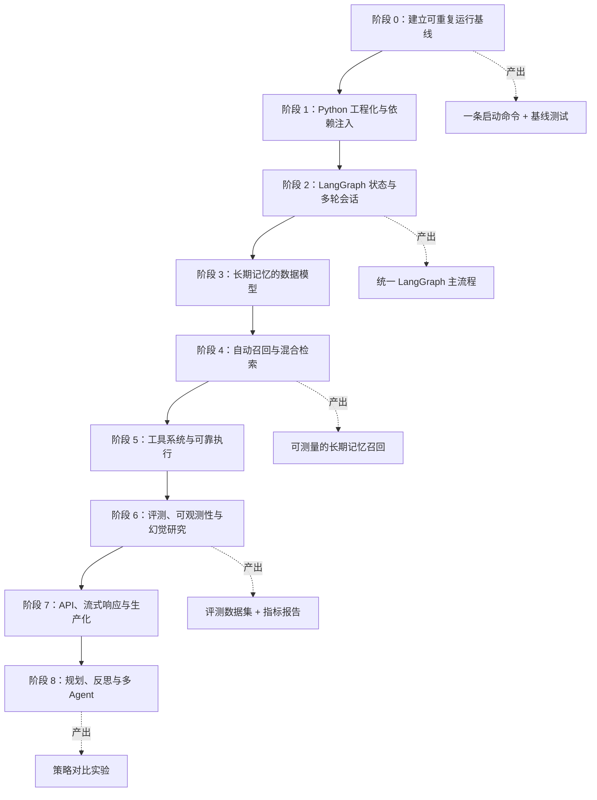
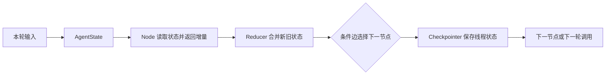
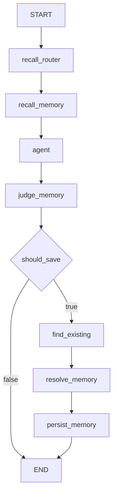
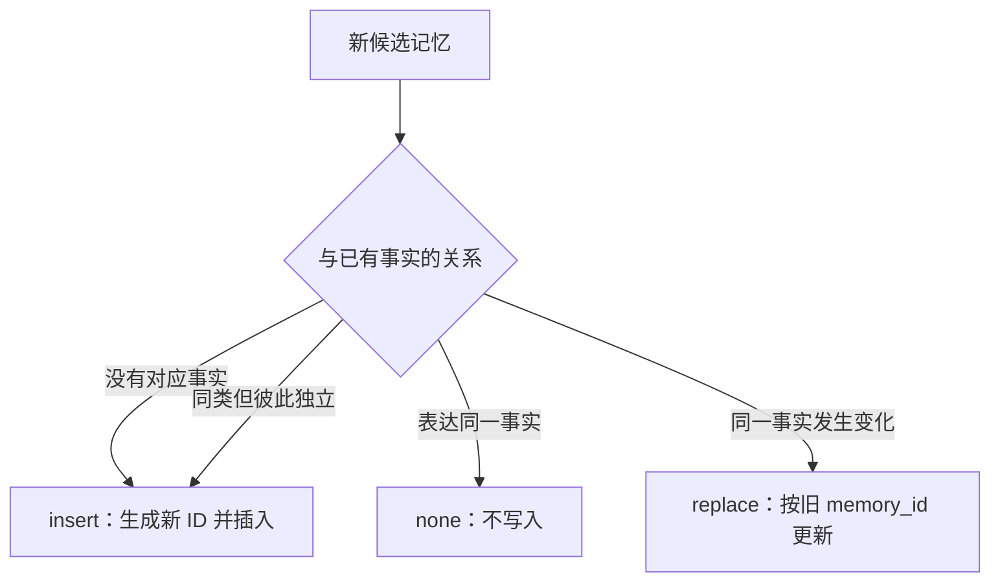
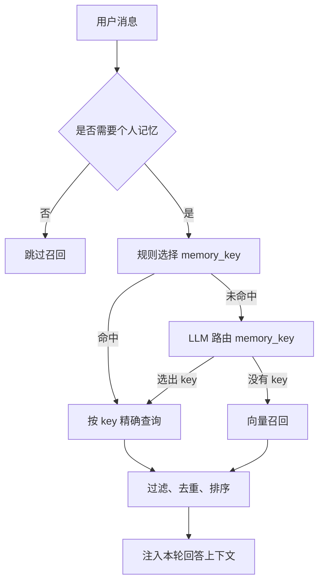
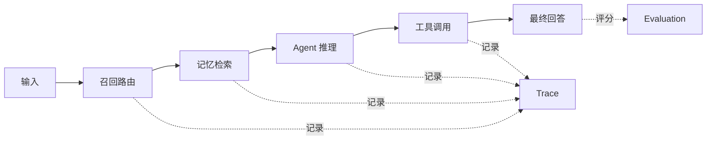
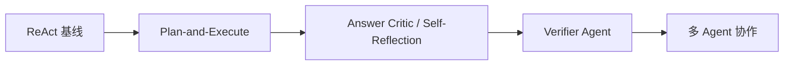
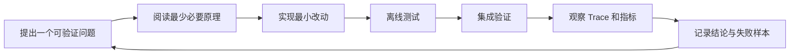

# Agent 项目学习进度路线（执行版）

> 基准日期：2026-09-30  
> 适用项目：当前仓库中的 LangChain / LangGraph / Milvus / FastAPI Agent  
> 使用方法：按阶段推进；只有通过“验收标准”后，才把阶段状态改为 `✅ 已完成`。

## 1. 路线目标

这份路线不是通用课程目录，而是围绕当前项目设计的实践路径。最终目标是把现有实验代码逐步发展为一个：

- 能稳定启动、配置清晰的 Agent 服务；
- 能正确区分用户和会话的多轮对话系统；
- 能自动召回、去重、更新长期记忆；
- 能使用搜索、网页、知识库等工具；
- 能通过离线评测衡量召回质量和幻觉；
- 能追踪调用链、处理失败并安全部署的完整系统。

## 2. 当前能力定位

### 2.1 已经具备的代码基础

| 能力 | 代码证据 | 当前判断 |
| --- | --- | --- |
| 模型调用 | `demos/batch_demo.py`、`tests/test_api.py` | 已实践，需补统一配置与测试 |
| Prompt / LCEL | `demos/prompt_template_demo.py`、`demos/runnable_branch_demo.py` | 已实践 |
| Tool Calling | `src/agent/smith.py`、`src/agent/tools.py` | 已实现基本工具绑定 |
| RAG | `scripts/milvus/`、`search_knowledge_base()` | 已打通基本检索链路 |
| 短期记忆 | `InMemorySaver` | 已接入，但用户/会话隔离不完整 |
| 长期记忆召回 | `chat()`、`_get_memories_by_keys()`、`_recall_memories()` | 已有规则、LLM 路由和向量兜底 |
| 长期记忆写入 | `judge_memory()`、`resolve_memories()`、`_insert_memory()` | 批量决策与指定旧 ID 更新已有离线测试，仍需 Milvus 联调 |
| LangGraph | `src/agent/graph.py` | 已建立节点和边，但尚未成为统一主入口 |
| HTTP API | `api/server.py` | 已有接口和聊天日志，启动链路需整理 |
| 学习任务管理 | `LearningPath`、`Topic`、`Task` API | 已有基础数据模型和 CRUD |

### 2.2 当前最关键的差距

1. 项目存在 `main.py` 与 `graph.py` 两套编排，职责重叠。
2. API 入口使用 `src.agent.main`，Graph 和示例仍有启动目录依赖。
3. 外部依赖在模块导入时初始化，离线测试会受到模型、Milvus 和环境变量影响。
4. `thread_id` 只使用 `session_id`，没有可靠隔离用户。
5. 长期记忆更新已有离线回归测试，但尚未在真实 Milvus 上验收。
6. Graph 缺少回答前自动召回节点。
7. 工具调用和完整服务链路仍缺少稳定自动化测试集。
8. 还没有用指标衡量召回效果和幻觉程度。

## 3. 总体学习地图



推荐主线：

```text
先让系统可运行
    → 再让状态和数据正确
    → 再优化召回质量
    → 再建立评测
    → 最后研究复杂 Agent 策略
```

不要在基础链路尚未稳定时优先增加 Multi-Agent。否则会把当前的身份、状态和记忆错误放大到多个 Agent 中，更难定位。

## 4. 阶段进度总表

状态说明：

- `✅ 已完成`：已有代码并通过明确验收；
- `🟡 进行中`：已有实现，但存在关键缺口；
- `⬜ 未开始`：尚未形成完整实现；
- `🔒 前置依赖`：必须等待上游阶段稳定。

| 阶段 | 主题 | 当前状态 | 完成标志 |
| --- | --- | --- | --- |
| 0 | 可重复运行基线 | 🟡 进行中 | 根目录可启动、离线测试不访问外部服务 |
| 1 | Python 工程化与依赖注入 | 🟡 进行中 | 配置、模型、数据库都可替换和测试 |
| 2 | LangGraph 状态与多轮会话 | 🟡 进行中 | 一条统一 Graph 支持隔离的多轮会话 |
| 3 | 长期记忆数据模型 | 🟡 进行中 | add / replace / none 语义正确且有测试 |
| 4 | 自动召回与混合检索 | 🟡 进行中 | 固定样本上可衡量召回效果 |
| 5 | 工具系统与可靠执行 | 🟡 进行中 | 工具权限、超时、错误和身份边界明确 |
| 6 | 评测、可观测性、幻觉研究 | ⬜ 未开始 | 有数据集、指标、实验报告和调用追踪 |
| 7 | API、流式响应与生产化 | 🟡 进行中 | API 可并发、可恢复、可观测、可部署 |
| 8 | 规划、反思与多 Agent | 🔒 前置依赖 | 能与基线做同数据集对比，而非只做 Demo |

---

## 5. 阶段 0：建立可重复运行基线

### 学习目标

理解“代码能读懂”“语法正确”“服务能启动”“核心行为正确”是四个不同层级。先建立一个任何时候都能重复执行的基线，后续每次学习和重构才有参照物。

### 必学知识

- Python 包、模块、`__init__.py` 与绝对/相对导入；
- `python -m package.module` 的启动方式；
- 虚拟环境、直接依赖与传递依赖；
- `.env`、进程环境变量和配置优先级；
- 单元测试、集成测试、端到端测试的区别；
- 模块导入副作用为什么会破坏测试收集。

### 项目练习

- [x] 将主入口整理为 `src/agent/main.py`。
- [ ] 统一 `src.agent.*` 内部导入方式。
- [ ] 明确 API 的唯一启动命令，例如从仓库根目录运行模块。
- [ ] 建立统一配置对象，集中管理模型、Milvus、PostgreSQL 和搜索服务地址。
- [ ] 缺少必需配置时给出清晰错误，不打印密钥。
- [ ] 将演示脚本与自动测试分开，禁止测试收集阶段调用真实模型或数据库。
- [ ] 增加最小 smoke test：导入核心包、构建假 Agent、调用健康检查。
- [ ] 将运行依赖与开发测试依赖分组，记录 Python 版本。

### 推荐新增或调整的结构

```text
src/agent/
├── __init__.py
├── config.py          # 配置读取和校验
├── dependencies.py    # 模型、Embedding、存储构造
├── graph.py           # 唯一业务编排
├── state.py           # Graph 状态模型
├── memory.py          # 长期记忆服务
├── tools.py           # 模型可调用工具
└── service.py         # 给 API 使用的 chat 服务

tests/
├── unit/
├── integration/
└── e2e/
```

### 验收标准

- [ ] 新环境按照 README 操作可以完成安装。
- [ ] 从项目根目录启动，不需要临时修改 `PYTHONPATH`。
- [ ] 没有 API Key、Milvus 和 PostgreSQL 时，单元测试仍能收集并执行。
- [ ] 集成测试只有显式选择时才访问外部服务。
- [ ] `python3 -m compileall` 和测试命令均通过。

### 阶段产出

- 一份准确的启动说明；
- 一个统一配置模块；
- 一组离线 smoke tests；
- 一条稳定的本地开发命令。

---

## 6. 阶段 1：Python 工程化与依赖注入

### 学习目标

把模型、Embedding、向量库和数据库看作可替换依赖，而不是导入文件时自动创建的全局对象。

### 必学知识

- 依赖注入与控制反转；
- Protocol / ABC 与面向接口编程；
- Repository 与 Service 的职责划分；
- Pydantic Settings；
- 同步函数、异步函数和阻塞 I/O；
- fixture、fake、mock、stub 的使用边界；
- 资源生命周期：创建、复用、关闭、失败恢复。

### 项目练习

- [ ] 定义 `MemoryStore` 接口：`get_by_keys`、`search`、`insert`、`replace`。
- [ ] 定义 `EmbeddingService` 接口：`embed_query`。
- [ ] 用 `MilvusMemoryStore` 实现真实存储。
- [ ] 用 `InMemoryMemoryStore` 实现离线测试存储。
- [ ] 将 `HuggingFaceEmbeddings` 从 `tools.py` 模块顶层移出。
- [ ] 将 `MilvusClient` 从 `tools.py` 模块顶层移出。
- [ ] 为 HTTP 搜索客户端设置统一 timeout 和错误模型。
- [ ] 为 FastAPI 使用 lifespan 或依赖系统管理资源。
- [ ] 分清哪些函数应该是纯函数，哪些函数允许 I/O。

### 建议接口

```python
class MemoryStore(Protocol):
    def get_by_keys(self, user_id: str, keys: list[str]) -> list[MemoryRecord]: ...
    def search(self, user_id: str, query_vector: list[float], limit: int) -> list[MemoryHit]: ...
    def insert(self, record: MemoryRecord) -> None: ...
    def replace(self, memory_id: str, record: MemoryRecord) -> None: ...
```

### 验收标准

- [ ] 导入 `src.agent` 不加载本地 Embedding 模型。
- [ ] 导入 `src.agent` 不连接或创建 Milvus Collection。
- [ ] 单元测试能注入 Fake 模型、Fake Embedding 和内存存储。
- [ ] 业务逻辑测试中不出现真实 HTTP 请求。
- [ ] 真实依赖只在应用启动或测试 fixture 中创建。

---

## 7. 阶段 2：LangGraph 状态与多轮会话

### 学习目标

把当前散落在 `chat()` 与 `graph.py` 中的逻辑统一为一张状态图，真正理解 State、Node、Edge、Reducer、Command 和 Checkpointer 的协作方式。

### 核心概念图



### 必学知识

- `TypedDict` / Pydantic 状态定义；
- `Annotated[list[BaseMessage], add_messages]`；
- 节点返回完整状态与返回状态增量的差异；
- 普通边、条件边和结束条件；
- `thread_id` 的含义；
- checkpoint 与业务数据库的不同职责；
- Graph 中断、恢复和幂等性；
- 节点失败后的状态边界。

### 目标 Graph



### 项目练习

- [ ] 合并 `main.py` 和 `graph.py`，只保留一套业务编排。
- [ ] 为 `messages` 增加 `add_messages` reducer。
- [ ] 将 `recalled_memories` 作为独立状态字段，不把动态记忆永久写进历史系统消息。
- [ ] 将 `user_id`、`session_id`、`memory_candidate`、`memory_resolution` 明确定义在状态中。
- [ ] 统一生成无歧义的 `thread_id`，至少同时包含用户和会话身份。
- [ ] 创建两轮对话测试，只在第二轮提交新用户消息。
- [ ] 验证同用户不同会话不共享短期历史。
- [ ] 验证不同用户使用相同 `session_id` 也不会串历史。
- [ ] 研究内存 Checkpointer 与 SQLite/PostgreSQL Checkpointer 的差异。

### 必做测试矩阵

| 用户 | 会话 | 调用 | 预期 |
| --- | --- | --- | --- |
| A | S1 | 第 1、2 轮 | 第 2 轮能看到第 1 轮 |
| A | S2 | 第 1 轮 | 看不到 A/S1 的短期历史 |
| B | S1 | 第 1 轮 | 看不到 A/S1 的短期历史 |
| A | S1 | 进程重启后 | 根据所选 Checkpointer 策略验证是否恢复 |

### 验收标准

- [ ] API 与测试调用同一张 Graph。
- [ ] 消息不会丢失，也不会重复追加。
- [ ] 工具调用消息和 ToolMessage 顺序完整。
- [ ] 用户和会话隔离测试全部通过。
- [ ] 文档明确说明进程重启后的状态行为。

---

## 8. 阶段 3：长期记忆的数据模型

### 学习目标

先保证长期记忆“存得对”，再讨论“搜得准”。向量检索无法找回已经被错误覆盖或错误替换的数据。

### 必学知识

- 主键、业务键和分类字段的区别；
- insert、upsert、update、replace 的语义；
- 事实去重、事实更新与多事实共存；
- 乐观并发控制和幂等写入；
- 数据迁移；
- 审计字段和软删除；
- 多租户数据隔离。

### 推荐记忆记录结构

```text
id              唯一记录 ID，不由 memory_key 单独决定
user_id         可信身份来源
memory_key      记忆类别
memory          规范化后的事实文本
vector          当前 Embedding 模型生成的向量
created_at      创建时间
updated_at      更新时间
source_session  来源会话
status          active / superseded / deleted
version         并发更新版本
embedding_model 向量模型版本
```

### 三种写入语义



### 项目练习

- [ ] 明确哪些 `memory_key` 是单值槽位，哪些允许多个事实。
- [x] 新增记录使用独立 ID，而不是固定的 `hash(user_id + memory_key)`。
- [x] `replace_memory()` 接收目标 `memory_id`。
- [x] 替换前验证目标记录属于当前用户及类别。
- [x] 目标不存在时拒绝操作，不能静默变成新增。
- [ ] 为记录增加创建时间、更新时间和来源信息。
- [x] 通过按字段查询兼容已有固定 ID 记录，无需改动其主键。
- [ ] 让结构化输出明确返回 `action`、`memory_id`、`reason` 和规范化事实。

### 必做测试样本

| 已有记忆 | 新消息 | 预期动作 |
| --- | --- | --- |
| 无 | 我主要学习全栈开发 | add |
| 主要学习全栈开发 | 我准备继续学习全栈 | none |
| 未来做前端 | 我现在决定转向后端 | replace 指定旧 ID |
| 喜欢咖啡 | 我也喜欢茶 | add，两条同时存在 |
| 用户 A 的职业方向 | 用户 B 更新职业方向 | 不得命中或修改 A |
| UUID 形式旧记录 | 新事实替换它 | ID 不变、总数不增加 |

### 验收标准

- [ ] 同类别独立事实可以共存。
- [ ] 重复事实不会重复写入。
- [ ] 更新后记录数量不增加，目标 ID 不变化。
- [ ] 跨用户更新被拒绝。
- [ ] 每个动作均有离线测试。

---

## 9. 阶段 4：自动召回与混合检索

### 学习目标

从“能搜到一些内容”进阶到“知道何时搜索、搜索哪些范围、结果是否足以支持回答”。

### 当前召回层次



### 必学知识

- 稀疏检索、稠密检索和混合检索；
- Embedding 的维度、归一化、模型版本；
- COSINE 与 L2 分数方向；
- Top-K、阈值、精确率和召回率；
- metadata filter；
- rerank；
- 查询改写；
- 新鲜度、冲突和事实有效期；
- Prompt Injection 与检索内容隔离。

### 项目练习

- [ ] 建立统一 `recall()` 服务，让自动召回与工具召回复用相同底层实现。
- [ ] 把 `limit`、阈值、Embedding 模型名放到集中配置。
- [ ] 对 memory key 精确查询、向量查询分别记录召回来源。
- [ ] 为召回结果增加去重和最大上下文长度。
- [ ] 研究是否需要按时间、新鲜度或状态过滤。
- [ ] 增加低分、无结果和 Milvus 异常时的明确降级。
- [ ] 防止记忆文本被当成系统指令。
- [ ] 用数据决定阈值，不凭感觉选择 `0.4` 或 `0.45`。

### 建立第一版召回数据集

至少准备以下类别，每类不少于 10 条：

- [ ] 明确需要职业方向记忆的问题；
- [ ] 明确需要当前工作记忆的问题；
- [ ] 需要多种 memory key 的问题；
- [ ] 表面包含“我”，但不需要长期记忆的问题；
- [ ] 没有“我”，但实际需要历史背景的问题；
- [ ] 同义表达和口语表达；
- [ ] 冲突事实与最新事实；
- [ ] 不同用户具有相似记忆的隔离样本；
- [ ] 无相关记忆样本；
- [ ] 恶意或带指令的记忆文本。

### 建议指标

```text
Router Recall    应召回样本中成功进入召回流程的比例
Router Precision 进入召回流程的样本中真正需要记忆的比例
Hit@K            目标事实是否出现在前 K 条
MRR              第一个正确事实的排名质量
Context Precision 注入上下文中真正相关事实的比例
Answer Faithfulness 回答是否忠实于当前消息和有效记忆
Cross-user Leak  跨用户错误召回次数，必须为 0
Latency          路由、Embedding、检索、生成各阶段耗时
```

### 验收标准

- [ ] 固定数据集可以一条命令重复运行。
- [ ] 每次调整阈值都能生成前后对比。
- [ ] 跨用户泄漏为 0。
- [ ] 召回服务失败时仍能给出不引用历史记忆的回答。
- [ ] 能解释一次错误发生在路由、检索、过滤还是生成阶段。

---

## 10. 阶段 5：工具系统与可靠执行

### 学习目标

理解 Agent 工具不是普通函数列表，而是一组具有输入契约、权限边界、超时策略和结果可信度的外部能力。

### 必学知识

- Tool Schema 与结构化参数；
- ReAct：模型决策、Action、Observation；
- 工具白名单和最小权限；
- 可信运行上下文与模型参数的区别；
- timeout、retry、rate limit 和 circuit breaker；
- 幂等工具与有副作用工具；
- 网页内容、工具结果中的 Prompt Injection；
- 工具输出裁剪和来源标注。

### 项目练习

- [ ] 为 `search_web()`、`fetch_webpage()`、`search_knowledge_base()` 统一错误返回类型。
- [ ] 将可信 `user_id` 通过运行上下文注入，不能让模型自由填写。
- [ ] 限制 `fetch_webpage()` 可访问的协议、地址类型和响应大小。
- [ ] 为每个工具定义 timeout、最大重试次数和最大输出长度。
- [ ] 区分只读工具与写操作工具。
- [ ] 记录 tool name、耗时、成功状态，不记录密钥和不必要的个人数据。
- [ ] 测试工具调用次数上限，防止无限循环。
- [ ] 给工具失败设计对用户有意义的降级回答。

### 验收标准

- [ ] 模型无法通过工具参数切换到其他用户身份。
- [ ] 搜索服务超时不会让请求无限等待。
- [ ] 工具输出过长时会被安全裁剪。
- [ ] 工具异常被记录，并转化为可控的 Agent 行为。
- [ ] 所有工具都有成功、空结果、超时、错误四类测试。

---

## 11. 阶段 6：评测、可观测性与幻觉研究

### 学习目标

让“效果变好了”成为可以被数据验证的结论。这个阶段开始真正连接项目的“大模型幻觉研究”主题。

### 必学知识

- Trace、Span、结构化日志；
- token、延迟和费用统计；
- 离线评测与在线评测；
- 确定性断言与 LLM-as-a-Judge；
- groundedness、faithfulness、relevance；
- 基线、对照组、消融实验；
- 非确定性测试和重复运行；
- 评测集污染与人工复核。

### 观测链路



### 项目练习

- [ ] 为每个请求生成 trace ID。
- [ ] 记录各 Graph 节点耗时、路由结果和工具状态。
- [ ] 对个人信息做日志脱敏。
- [ ] 将召回评测集扩展为回答评测集。
- [ ] 建立“无记忆 / 精确 key / 向量召回”三组基线。
- [ ] 设计带答案依据的测试样本。
- [ ] 同一配置重复运行，观察结果方差。
- [ ] 输出 Markdown 或 JSON 评测报告。
- [ ] 如使用 LangSmith，记录项目名、数据集、实验名和配置版本。

### 幻觉实验矩阵

| 实验 | 对照组 | 实验组 | 重点指标 |
| --- | --- | --- | --- |
| 长期记忆价值 | 不注入记忆 | 注入正确记忆 | 个性化正确率、事实一致性 |
| 错误记忆影响 | 无记忆 | 注入过期/冲突记忆 | 冲突处理能力 |
| 检索阈值 | 多个阈值 | 多个阈值 | Hit@K、上下文精度、幻觉率 |
| 反思节点 | 普通回答 | 回答后反思 | 错误修正率、额外延迟 |
| 规划策略 | ReAct | Plan-and-Execute | 完成率、工具误用、成本 |

### 验收标准

- [ ] 一次失败可以通过 trace 定位到具体节点。
- [ ] 至少有 50 条固定评测样本。
- [ ] 每个实验保留模型、Prompt、阈值和代码版本。
- [ ] 报告同时展示质量、延迟和成本，不能只看单一分数。
- [ ] LLM Judge 结果经过抽样人工复核。

---

## 12. 阶段 7：API、流式响应与生产化

### 学习目标

让实验系统具备真实服务需要的并发、恢复、安全和运维能力。

### 必学知识

- FastAPI 依赖、lifespan、异常处理；
- 同步 I/O 与异步服务器的阻塞问题；
- SSE / WebSocket 流式响应；
- 身份认证与授权；
- 数据库事务；
- 并发更新、重复请求与幂等键；
- CORS、限流、请求大小限制；
- readiness、liveness 和 graceful shutdown；
- Docker、配置分层和数据备份。

### 项目练习

- [ ] API 的用户身份来自可信认证上下文，而不是任意请求字段。
- [ ] 将阻塞的模型和 Milvus 调用妥善放入异步服务。
- [ ] 定义统一成功与错误响应格式。
- [ ] Agent 成功但聊天日志写入失败时，明确事务和补偿策略。
- [ ] 增加流式事件：开始、token、tool_start、tool_end、done、error。
- [ ] 使用持久化 Checkpointer。
- [ ] 定义同一会话并发请求的串行或冲突策略。
- [ ] 增加请求超时、限流和取消处理。
- [ ] 完善 `/health`，区分进程存活与依赖就绪。
- [ ] 为数据库和 Milvus 制定备份、迁移和恢复步骤。

### API 端到端验收

- [ ] 两轮连续聊天能保留上下文。
- [ ] 新会话可以召回同用户的长期记忆。
- [ ] 不同用户无法读取彼此记录。
- [ ] 工具调用过程可以流式展示。
- [ ] 客户端中断后服务端能停止不必要的工作。
- [ ] 单个外部依赖失败时返回明确错误或降级结果。
- [ ] 多请求并发不会产生重复记忆或错乱状态。

---

## 13. 阶段 8：规划、反思与多 Agent

### 开始条件

只有下面条件全部满足后再进入本阶段：

- [ ] 基础 Graph 行为稳定；
- [ ] 用户、会话和记忆隔离测试通过；
- [ ] 已有固定评测集；
- [ ] 已有 trace 和延迟统计；
- [ ] 单 Agent 已形成可比较的基线。

### 学习顺序



### 必学知识

- ReAct；
- Plan-and-Execute；
- Reflection / Critic；
- Router 与 Supervisor；
- Agent 间状态共享；
- 终止条件和循环上限；
- 多 Agent 的成本、延迟与错误传播；
- 多样性和独立性，而不是简单重复调用同一模型。

### 项目练习

- [ ] 保存当前单 Agent 结果作为基线。
- [ ] 新增 planner，只输出结构化步骤，不直接执行工具。
- [ ] executor 逐步执行，并保存每步 observation。
- [ ] 加入 verifier，检查答案是否得到检索或工具证据支持。
- [ ] 设置最大步骤数、最大工具次数和总超时。
- [ ] 在同一评测集上比较完成率、幻觉率、延迟和 token。
- [ ] 只有当多 Agent 显著改善目标指标时，才保留复杂架构。

### 验收标准

- [ ] 新策略与单 Agent 使用完全相同的测试集。
- [ ] 报告中同时展示收益与额外成本。
- [ ] 循环一定有程序级终止条件。
- [ ] Verifier 能引用具体证据，而不是只输出“看起来正确”。
- [ ] 可以通过配置关闭规划或反思节点并回到基线。

---

## 14. 建议的 10 周执行计划

每周不以“看完资料”为完成标准，而以可验证产出为完成标准。

### 第 1 周：启动与项目结构

- 学习：Python 包、模块导入、Pydantic Settings、测试分层。
- 实作：修复入口文件和导入；建立统一配置。
- 测试：包导入、配置缺失、配置覆盖。
- 产出：一条启动命令和一条离线测试命令。

### 第 2 周：依赖注入与离线测试

- 学习：Protocol、Repository、fixture、fake/mock。
- 实作：抽象模型、Embedding 和 MemoryStore。
- 测试：无外部服务时验证记忆业务逻辑。
- 产出：FakeMemoryStore 和第一组单元测试。

### 第 3 周：LangGraph 状态机

- 学习：State、Node、Edge、Reducer、Checkpointer。
- 实作：合并两套流程，加入回答前召回节点。
- 测试：节点单测、条件路由测试。
- 产出：唯一 Graph 主入口和 Mermaid 图。

### 第 4 周：多轮会话与身份隔离

- 学习：thread、session、user 的边界；持久化 checkpoint。
- 实作：统一 thread ID；修复消息 reducer。
- 测试：用户 × 会话矩阵。
- 产出：多轮和隔离测试报告。

### 第 5 周：长期记忆写入正确性

- 学习：主键、幂等、数据迁移、并发更新。
- 实作：独立 ID、新增/替换分离、目标 ID 校验。
- 测试：add / replace / none / 跨用户。
- 产出：记忆契约文档和迁移方案。

### 第 6 周：召回质量

- 学习：Embedding、Top-K、阈值、混合检索、rerank。
- 实作：统一 recall 服务，集中参数。
- 测试：召回数据集与阈值对比。
- 产出：第一版召回评测报告。

### 第 7 周：工具可靠性

- 学习：工具权限、超时、重试、注入风险。
- 实作：统一工具错误、可信身份注入、输出裁剪。
- 测试：成功/空结果/超时/异常测试矩阵。
- 产出：工具契约与安全边界说明。

### 第 8 周：可观测性与评测

- 学习：trace、评测指标、LLM Judge、实验设计。
- 实作：节点级 tracing 和结构化日志。
- 测试：不少于 50 条固定样本。
- 产出：基线实验报告。

### 第 9 周：API 与流式输出

- 学习：FastAPI 生命周期、SSE、并发与取消。
- 实作：流式聊天、统一错误、持久化 Checkpointer。
- 测试：端到端、多请求并发和依赖故障。
- 产出：可演示的稳定聊天 API。

### 第 10 周：规划与反思实验

- 学习：Plan-and-Execute、Reflection、Verifier。
- 实作：增加可配置的 planner / verifier 节点。
- 测试：与第 8 周基线做同集对比。
- 产出：策略收益、延迟与成本对比报告。

---

## 15. 每周固定学习循环



建议每周都完成下面六项：

1. 写清楚本周要解决的一个问题。
2. 先写验收样本，再改实现。
3. 保持改动只覆盖一个主要概念。
4. 至少保留一个失败样本，避免只测试成功路径。
5. 记录修改前后的行为与指标。
6. 更新本路线中的复选框和学习日志。

## 16. 单次学习任务模板

复制下面内容到 Issue、任务记录或学习日志中：

```markdown
### 任务名称

#### 我要回答的问题
- 

#### 当前行为
- 

#### 期望行为
- 

#### 最小测试样本
- 正常：
- 边界：
- 错误：
- 隔离：

#### 实现涉及
- 文件：
- 函数：
- 状态字段：
- 外部依赖：

#### 验证结果
- 单元测试：
- 集成测试：
- Trace：
- 指标变化：

#### 我真正学会了什么
- 

#### 仍未解决的问题
- 
```

## 17. 阶段复盘标准

完成一个阶段时，不要只问“代码写完了吗”，还要逐项回答：

- [ ] 我能不用看代码画出这一阶段的数据流吗？
- [ ] 我能说清楚每个状态字段由谁创建、谁读取、谁修改吗？
- [ ] 我能区分业务规则错误、模型错误、检索错误和基础设施错误吗？
- [ ] 我能在不访问真实外部服务的情况下复现核心行为吗？
- [ ] 我能用测试证明用户数据不会串吗？
- [ ] 我能从日志或 Trace 定位失败节点吗？
- [ ] 我能解释这次改动带来的质量、延迟和成本变化吗？
- [ ] README、架构图和源码是否一致？

## 18. 当前最应该立即开始的三个任务

### 任务 A：修复并统一入口

目标：从根目录稳定导入和启动 API。  
关联问题：文件名、包导入、`.env`、直接依赖。  
完成后才能可靠开展其余实验。

### 任务 B：给记忆服务做离线 Fake

目标：不启动 Milvus、不加载 BGE 模型也能测试 add / replace / none。  
关联知识：依赖注入、接口设计、pytest fixture。  
这是从“Demo 编程”迈向“可验证系统”的关键一步。

### 任务 C：统一为 LangGraph 主流程

目标：形成 `recall → agent → judge → resolve → persist` 的唯一调用链。  
关联知识：State、Reducer、条件边、Checkpointer。  
完成后再继续优化召回和研究复杂策略。

## 19. 推荐阅读顺序（以项目文件为主）

1. `readme.md`：了解项目整体边界。
2. `docs/TODO.md`：了解已确认问题与修复顺序。
3. `src/agent/main.py`：理解当前回答前召回和回答后写入。
4. `src/agent/tools.py`：理解工具、Embedding 与 Milvus 操作。
5. `src/agent/graph.py`：理解现有 Graph 节点和边。
6. `src/agent/schemas.py`：理解状态与结构化输出。
7. `src/agent/smith.py`：理解 `create_agent` 的工具循环封装。
8. `docs/auto_recall.md`：系统学习长期记忆召回。
9. `api/server.py`、`api/db.py`、`api/models.py`：理解服务与持久化边界。
10. `tests/` 与 `src/agent/test/`：将现有演示逐步整理成可靠测试。

## 20. 最终毕业项目

当所有阶段完成时，用一个端到端场景验收整个系统：

1. 用户 A 在会话 1 表达当前职业与未来方向。
2. 系统正确拆分并保存长期事实。
3. 用户 A 在会话 2 询问个性化学习路线。
4. 系统自动召回正确记忆并给出有依据的回答。
5. 用户 A 更新职业方向，系统按旧记录 ID 完成替换。
6. 用户 B 使用同样的会话 ID，不能看到用户 A 的任何历史或记忆。
7. 搜索服务失败时，系统能降级回答。
8. Milvus 暂时不可用时，系统不会伪造记忆内容。
9. Trace 能展示召回、工具、生成和写入的完整执行顺序。
10. 评测报告能对比基础 Agent、召回 Agent、反思 Agent 的质量、延迟和成本。

达到这些条件，才意味着已经从“会调用模型和框架”进阶到“能设计、验证并维护一个完整 Agent 系统”。
